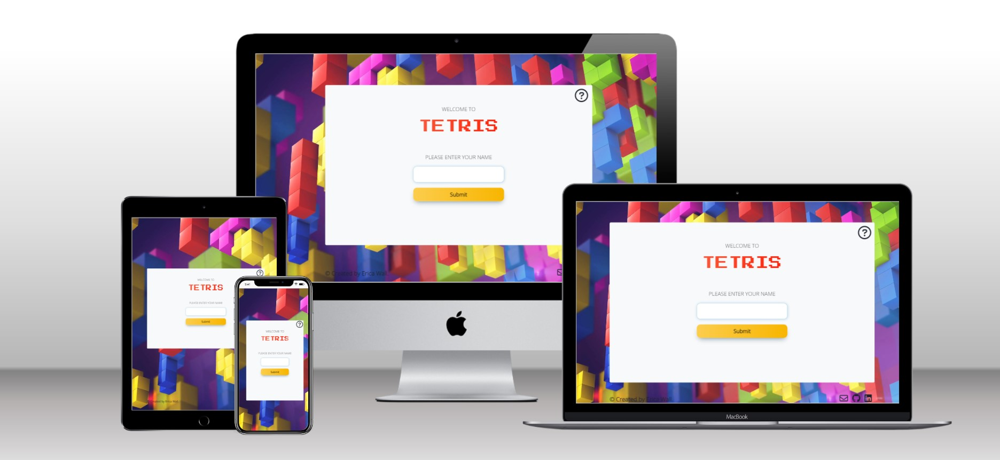
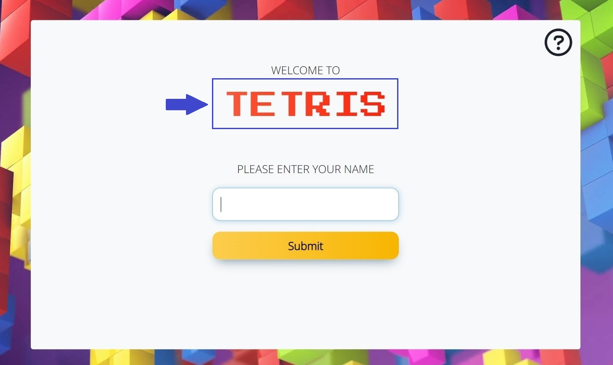
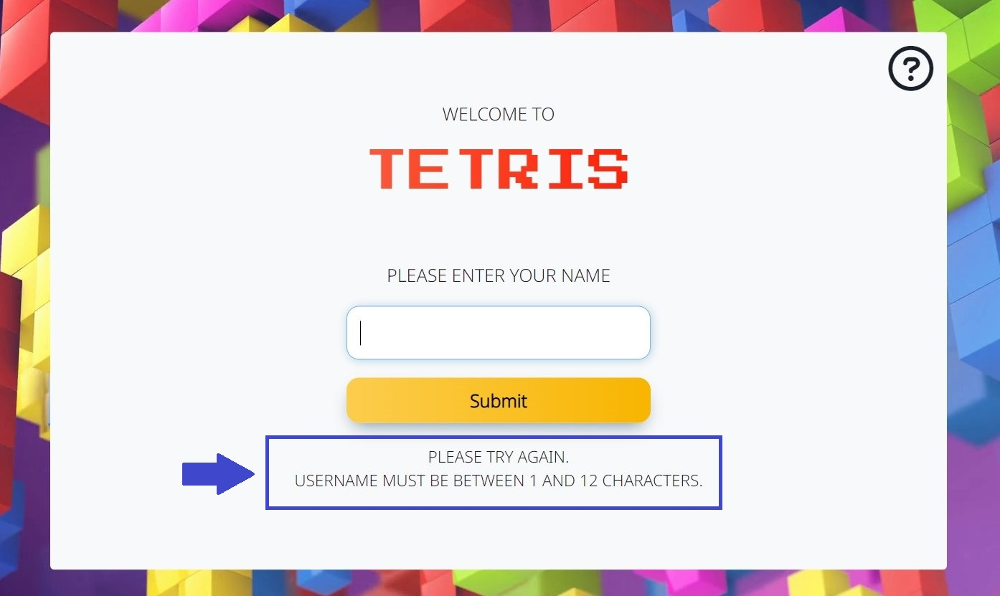
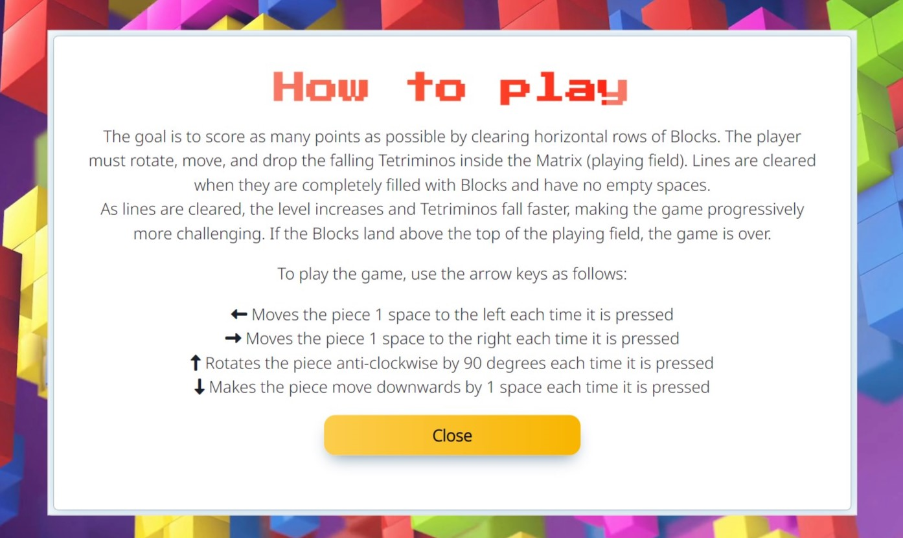
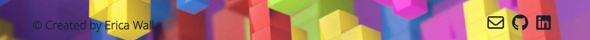
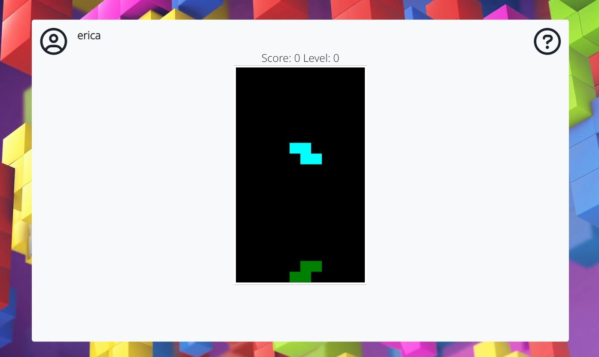
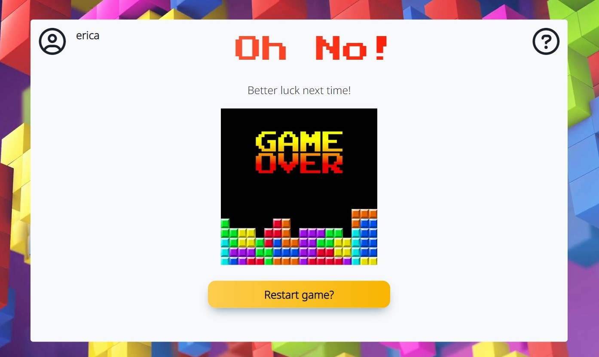
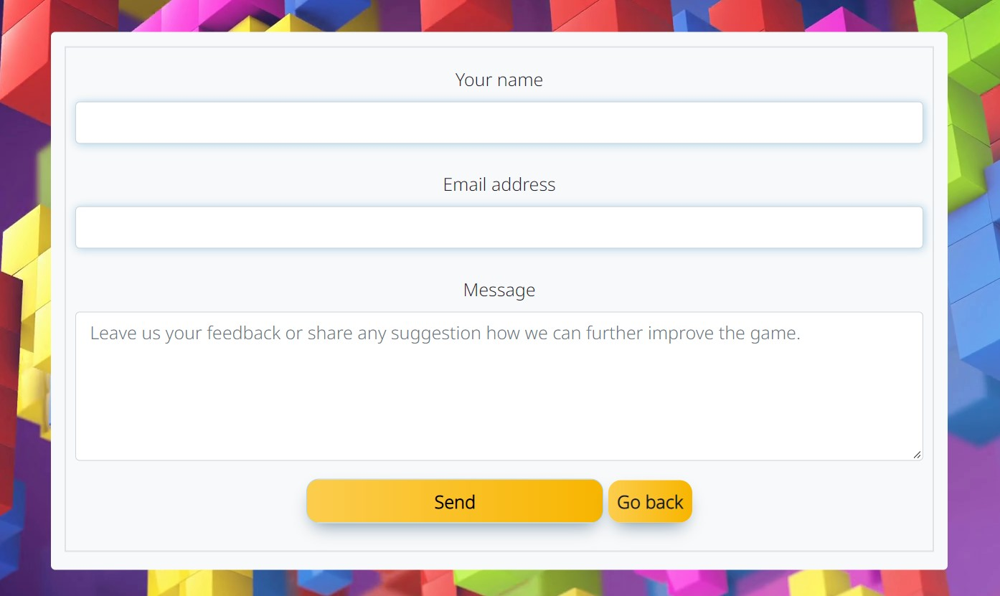
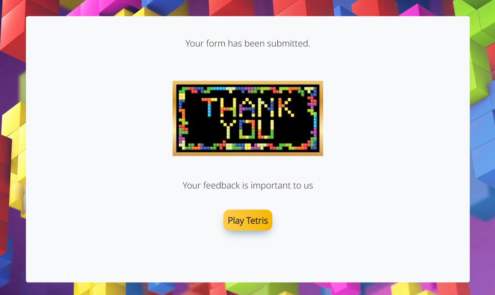
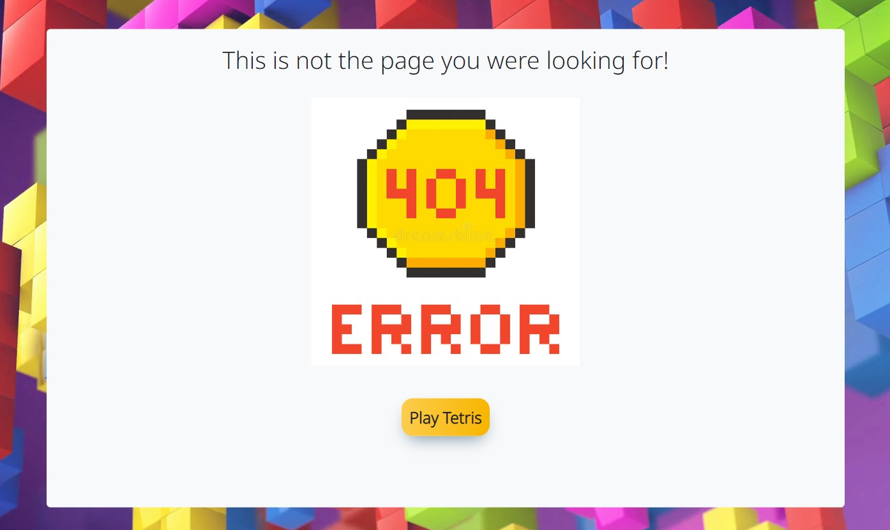

**Developer: Erica Wall**

[Visit live website](https://ericawall.github.io/portfolio-project-2/)

## Table of Content
  - [Project Goals](#project-goals)
    - [User Goals](#user-goals)
    - [Site Owner Goals](#site-owner-goals)
  - [User Experience](#user-experience)
    - [Target Audience](#target-audience)
    - [User Requirements and Expectations](#user-requirements-and-expectations)
  - [User Stories](#user-stories)
    - [Site User](#site-user)
    - [Site Owner](#site-owner)
  - [Design](#design)
    - [Colour Scheme](#colour-scheme)
    - [Fonts](#fonts)
    - [Structure](#structure)
    - [Wireframes](#wireframes)
  - [Technologies Used](#technologies-used)
    - [Languages](#languages)
    - [Frameworks, Libraries & Tools](#frameworks-libraries--tools)
  - [Features](#features)
  - [Validation](#validation)
    - [HTML Validation](#html-validation)
    - [CSS Validation](#css-validation)
    - [JavaScript Validation](#javascript-validation)
    - [Accessibility](#accessibility)
    - [Performance](#performance)
  - [Testing](#testing)
    - [Performing tests on various devices](#performing-tests-on-various-devices)
    - [Browser compatibility](#browser-compatibility)
    - [Testing user stories](#testing-user-stories)
  - [Bugs](#bugs)
  - [Deployment](#deployment)
  - [Credits](#credits)
  - [Acknowledgements](#acknowledgements)

## Project Goals

The goal of this project was to create a simple, interactive and user-friendly version of the well-known Tetris game.

### User Goals

- Play a game with simple rules that is fun and engaging.
- Challenge themselves on different words and phrases.

### Site Owner Goals

- Create a game which is entertaining and engaging.
- Create visually appealing design.
- Create a simple navigation around website.
- Provide fully responsive and accessible website.

## User Experience

### Target Audience

- The game can be played by people of all ages and cultures.
- Anyone who wants to have fun playing a game with simple and clear rules.

### User Requirements and Expectations

- Easy to understand game rules.
- Simple navigation.
- Simple presentation of content on the page that makes logical sense.
- A responsive wesite that allows the user to play the game on any device.
- Links and functions that work as expected.
- An easy way to contact the developer and leave feedback.
- Accessibility.

## User Requirements

### Site User

1. I want to easily understand the rules of the game.
2. I want to enter my name and have it visible on screen while the game is played.
3. I want to be able to play the game by using the keyboard.
4. I want to be able to play the game on desktop, tablet and mobile devices.
5. I want to be able to get in touch with the developer.
6. I want to be sure that my message has been sent.

### Site Owner

7. I want user to easily understand the game.
8. I want the user to be able to challenge themselves.
9. I want my game to be fully responsive.
10. I want the user to come to a 404 error page instead of having to use the browser back button if they enter a url that does not exist.
11. I want user to be able to contact me and provide their feedback.

## Design

### Colour Scheme

The colour scheme across the screens was kept simple and consistent and was inspired by the retro colours of the original tetris game pieces (called tetrominos").
- Game title is red, game navigation buttons are orange, highlights are in shades of light blue.

### Fonts

Google Fonts were implemented on the website. Noto Sans with sans-serif fallback was used across all screens as I found it highly readable and clear. To reflect the retro aspect of the game, the Press Start 2P with a cursive fallback was used for the game title, instructions and game over headings.

### Structure

The structure of the website was designed to be easy to learn and navigate. Each screen of the game appears in the same container with maintained harmony of all elements within.

- The game consist of the following screens:
  - A home page / start screen with instructions icon in the top line, game title and user login.
  - Main game screen - it contains the tetris game, current score and current level.
  - Game over screen - the option to restart the game is shown.
- A modal with game instructions which pops up when the instructions icon is clicked, available on all game screens.
- The contact page with contact form which allows users to send an email to the developer and provide their feedback
- A contact form sublitted page, with a button to return to the home page.
- A separate 404 error page.

### Wireframes

Big screens - laptop & desktop

Medium screens - tablets

Small screens - mobile

## Technologies Used

### Languages

- HTML
- CSS
- JavaScript

### Frameworks, Libraries & Tools

- [Techsini](https://techsini.com/multi-mockup/index.php) was used to create the multi-device mock-up you can see at the start of this README.md file.
- [Balsamiq](https://balsamiq.com/) to create the wireframes for the project.
- [Bootstrap v5.1.3](https://getbootstrap.com/).
- [EmailJS](https://www.emailjs.com) used to send email from the contact form.
- [Font Awesome](https://fontawesome.com/) - Icons from Font Awesome were used throughout the site.
- [Git](https://git-scm.com/) was used for version control within VSCode to push the code to GitHub.
- [GitHub](https://github.com/) was used as a remote repository to store project code.
- [Google Fonts](https://fonts.google.com/).
- [Remove.bg](https://www.remove.bg/) was used to remove background on logos.
- [Chrome dev tools](https://developers.google.com/web/tools/chrome-devtools) were used for debugging of the code and check site for responsiveness.
- [WC3 Validator](https://validator.w3.org/), [Jigsaw W3 Validator](https://jigsaw.w3.org/css-validator/) and [JShint](https://jshint.com/) were all used to validate the website.

## Features

The website has 3 webpages consisting of 9 distinct features described below:

### Home screen

#### Title animation
- When the page is loaded the game title fades-in.

See feature

#### Username input
- User is asked to enter their name in the input field. The username needs to be between 1 and 12 characters long. The are no restrictions on characters type. However, if the input field is left blank, then a feedback message is displayed for user to try again. Once a valid username has been provided, the name is displayed next to the user icon on the next screen and user is able to select the difficulty level of the game.
- Username remains displayed on all game screens

See feature

### Instructions Modal
- A modal with game instructions which pops up when the instructions icon is clicked
- Available on all game screens
- Background color is set slightly darker than on the game screen

See feature

### Footer
- Featured on all pages
- Contains link to contact form (opening in the same window), github page and social media (opening in a separate window)

See feature

### Game screen
- The below elements are displayed on the screen:
  - Username
  - Game instructions icon
  - Tetris Game
  - Current score and level

See feature

### Game Over Screen
- The below elements are displayed on the screen:
  - Username
  - Picture of game over with a tetris theme
  - Button to restart the game

See feature

### Contact Form
- User is able to provide feedback about the game
- EmailJS has been used to send an email to developer with user's data and message

See feature

### Contact Form confirmation screen
- Thank you message is displayed
- Contains return to the main screen button
- Picture of thank you with a tetris theme

See feature

### 404 error page
- The site has been given a 404 error page which is displayed if the user enters a url that does not exist.
- Contains return to the main screen button
- Picture of 404 error message with a tetris-ish/pixelart thee

See feature

## Validation

### HTML Validation

The W3C Markup Validation Service was used to validate the HTML of the website. All pages pass with no errors, However, one warning was identified linked to.

Home

Contact form page

404 error page

### CSS Validation

The W3C Jigsaw CSS Validation Service was used to validate the CSS of the website.
When validating all website, it passes with no errors. However, some warning are identified linked to Bootstrap v5.1.3.
When validating my own internal CSS, the validator shows no errors and four warning associated with vendor extension (-webkit-appearance).

All site

Style.css

### JavaScript Validation

JSHint JS Validation Service was used to validate the Javascript files. No significant issues were found.

game.js

game-data.js

contact-form.js

### Accessibility

The WAVE WebAIM web accessibility evaluation tool was used to ensure the website met high accessibility standards.
All site pass with 0 errors.

Home page

Contact form page

404 page

### Performance

Google Lighthouse in Google Chrome Developer Tools was used to test the performance of the website.

Home page

Contact form page

404 page

## Testing

### Performing tests on various devices

The website was tested using Google Chrome Developer Tools Toggle Device Toolbar to simulate viewports of different devices.

The website was tested on the following devices:
- Dell Inspiron 5570 (laptop screen size)
- Huawei (tablet screen)
- Huawei P20 Pro (mobile screen)

### Browser compatibility

- Testing has been carried out on the following browsers:
  - Googe Chrome Version 96.0.4664.110 (Official Build) (64-bit)
  - Firefox Browser 95.0.2 (64-bit)

### Testing user expectations

1. I want to easily understand the rules of the game

| **Feature**       | **Action**        | **Expected Result**                  | **Actual Result** |
| ----------------- | ----------------- | ------------------------------------ | ----------------- |
| Instructions Icon | Click on the icon | Modal with game instructions pops up | Works as expected |

Screenshot

2. I want to enter my name and have it visible on screen while the game is played

| **Feature**    | **Action**                                                           | **Expected Result**                               | **Actual Result** |
| -------------- | -------------------------------------------------------------------- | ------------------------------------------------- | ----------------- |
| Username input | Type user name (1-12 characters) and click button or press Enter key | User log in and name displayed in top left corner | Works as expected |

Screenshot

3. I want to be able to choose a difficulty level for the game

| **Feature**             | **Action**                                                             | **Expected Result**                                                                                     | **Actual Result** |
| ----------------------- | ---------------------------------------------------------------------- | ------------------------------------------------------------------------------------------------------- | ----------------- |
| Difficulty level screen | Click one of the three buttons on the screen to play the relevant game | The chosen game level screen loads. Game level and number of guesses are displayed on top right corner. | Works as expected |

Screenshot

4. I want to have different categories of phrases to guess from

| **Feature**                           | **Action**                               | **Expected Result**                                                       | **Actual Result** |
| ------------------------------------- | ---------------------------------------- | ------------------------------------------------------------------------- | ----------------- |
| Difficulty level screen & Game screen | Select the level of desired game to play | The phrase category is displayed on the game screen above the sun picture | Works as expected |

Screenshot

5. I want to be able to play the game both by clicking the mouse and by using the keyboard

| **Feature** | **Action**                                                               | **Expected Result**                                                                        | **Actual Result** |
| ----------- | ------------------------------------------------------------------------ | ------------------------------------------------------------------------------------------ | ----------------- |
| Game screen | Click on the displayed alphabet buttons or press the key on the keyboard | The letter which have already been clicked/pressed changes color and cannot be used again. | Works as expected |

Screenshot

9. I want to be able to play the game on desktop, tablet and mobile devices

| **Feature**                                   | **Action**                | **Expected Result**                      | **Actual Result** |
| --------------------------------------------- | ------------------------- | ---------------------------------------- | ----------------- |
| Every page has been designed to be responsive | Change device screen size | The site works on different screen sizes | Works as expected |

Screenshot

10. I want to be able to get in touch with the developer

| **Feature**  | **Action**                               | **Expected Result**       | **Actual Result** |
| ------------ | ---------------------------------------- | ------------------------- | ----------------- |
| Contact Form | Click on the envelope icon in the footer | Displays the contact form | Works as expected |

Screenshot

11. I want to be sure that my message has been sent

| **Feature**                      | **Action**                                           | **Expected Result**                        | **Actual Result** |
| -------------------------------- | ---------------------------------------------------- | ------------------------------------------ | ----------------- |
| Contact Form confirmation screen | Fill in the contact form and click the submit button | The contact form confirmation is displayed | Works as expected |

Screenshot

12. I want user to easily understand the game

| **Feature**       | **Action**                      | **Expected Result**                  | **Actual Result** |
| ----------------- | ------------------------------- | ------------------------------------ | ----------------- |
| Instructions Icon | Click on the icon on any screen | Modal with game instructions pops up | Works as expected |

Screenshot

13.  I want the user to be able to challenge themselves

| **Feature**             | **Action**                                                                                                                  | **Expected Result**                             | **Actual Result** |
| ----------------------- | --------------------------------------------------------------------------------------------------------------------------- | ----------------------------------------------- | ----------------- |
| Difficulty level screen | User selects on of the three available levels of the game which includes the hard version with only a few available guesses | The game level screen loads of the chosen game. | Works as expected |

Screenshot

14. I want my game to be fully responsive

| **Feature**                                   | **Action**                | **Expected Result**                      | **Actual Result** |
| --------------------------------------------- | ------------------------- | ---------------------------------------- | ----------------- |
| Every page has been designed to be responsive | Change device screen size | The site works on different screen sizes | Works as expected |

Screenshot

15.  I want the user to come to a 404 error page instead of having to use the browser back button if they enter a url that does not exist

| **Feature**    | **Action**           | **Expected Result**                                                                       | **Actual Result** |
| -------------- | -------------------- | ----------------------------------------------------------------------------------------- | ----------------- |
| 404 error page | Page cannot be found | When a user types the wrong address or cannot find a page they are rerouted to a 404 page | Works as expected |

Screenshot

16. I want user to be able to contact me and provide their feedback

| **Feature**  | **Action**                                                  | **Expected Result**                                              | **Actual Result** |
| ------------ | ----------------------------------------------------------- | ---------------------------------------------------------------- | ----------------- |
| Contact Form | User fills in the contact form and clicks the submit button | Developer receives email with user's contact details and message | Works as expected |

Screenshot

## Bugs

| Bug                                                                                                                                         | Fix                                                                                    |
| ------------------------------------------------------------------------------------------------------------------------------------------- | -------------------------------------------------------------------------------------- |
| All div with difficulty level buttons was responsive to click event and game level which appeared on the game screen was 'null'             | Added code for click event to only respond on elements with specific class (buttons)   |
| W3C Markup Validation Service highlighted that heading was not closed                                                                       | Corrected the error by closing the h1 tag                                              |
| Number of remaining guesses displayed on the cloud icon went below 0                                                                        | Amended code to display 0 when there were no guesses left                              |
| Images for medium & hard level game were not showing on the game screen                                                                     | There was an error in image path in game-data.js file which I corrected                |
| Game container was going off the screen for iPhone 5/ SE when tested with Chrome DevTools                                                   | Changed offset of game container for screens max-width: 390px                          |
| When added footer to the game screen it was located at the top of the screen                                                                | Set footer with position fixed                                                         |
| Whilst the contact form was validated, no data was sent to email                                                                            | Set up an email template and amended code with specific contact_service & contact_form |
| Game container was going off the background leaving a white space below the background image on mobile and tablet screen in horizontal view | Changed background image position from absolute to fixed                               |
| Contact form username input was pushed off the screen when user clicked on the element, making the input invisible to the user              | Add contact form container offset on username input focus                              |

## Deployment

### GitHub Pages
The website was deployed using GitHub Pages by following these steps:
1. In the GitHub repository navigate to the Settings tab
2. On the left hand menu select Pages
3. For the source select Branch: main
4. Once saved, GitHub will refresh and your website will be publishd from GitHub repository
5. The link to your published website will appear: "Your site is published at https://ericawall.github.io/portfolio-project-2/"

## Credits

### Images

- Site icons in top line of game container and footer were taken from [Fontawesome](https://fontawesome.com/)
- Background image was found on [storyblocks](https://dm0qx8t0i9gc9.cloudfront.net/thumbnails/video/cW5lDBG/tetris-game-beautiful-backdrop-with-3d-tetris-blocks_bmdysw8ye_thumbnail-1080_01.png)
- Image for contact form confirmation was used from [dreamstime](https://thumbs.dreamstime.com/b/illustration-design-tetris-russia-puzzle-thank-you-frame-banner-rich-black-golden-background-tetris-russia-170320373.jpg)
- Image for the game over screen was taken from [voicemod](https://us-tuna-sounds-images.voicemod.net/1a19ab97-f5c3-4d6e-b1da-72aeb6a21153.jpg)
- 404 error page image was taken from [dreamstime](https://www.google.com/url?sa=i&url=https%3A%2F%2Fwww.dreamstime.com%2Fstock-illustration-error-page-pixel-retro-game-style-set-image95927294&psig=AOvVaw1P6pEoGN8NB69RAnIjEG2_&ust=1666716547538000&source=images&cd=vfe&ved=0CA0QjRxqFwoTCLCE5pKp-foCFQAAAAAdAAAAABAE)
- Multi-screen mock-up image created at [Techsini](https://techsini.com/multi-mockup/index.php)

### Code
- Overall layout of the website, and structure of ReadMe documentation was heavily inspired by [The Sunshine Guessing Game](https://aleksandracodes.github.io/CI_PP2_SunshineGuessing/index.html) by Aleksandra Haniok.
- [Instructions Modal](https://getbootstrap.com/docs/5.1/components/modal) was built using the Bootstrap v5.1.3 documentation
- [EmailJS](https://www.emailjs.com/docs/tutorial/creating-contact-form) official tutorial & playground environment within EmailJS. Email Templates were used to create a contact form with email being sent to desired address.
- Game title with a gradient was created with [CSS Text Gradient Generator](https://www.cssportal.com/css-text-gradient-generator/)
- Fade-in effect for game title was made using [this source](https://www.geeksforgeeks.org/how-to-create-fade-in-effect-on-page-load-using-css/)
- Setting the arrow keys for the game controls was make using [this source](https://www.toptal.com/developers/keycode)
- How to create the tetris game itself was inspired by [Code Explained](https://www.codeexplained.dev/2018/08/create-tetris-game-using-javascript.html), [this Educatative blog page](https://www.educative.io/blog/javascript-tutorial-build-tetris) by Ryan Thelin, [this GitHub page](https://github.com/CatalinStefan/Tetris) by Stefan Catalin,  [This Codepen page](https://codepen.io/skybirdtrill/pen/NNwzqN) by Skybird Trill and [this GitHub page](https://8000-dionyziz-canvastetris-a9qt4sjap3p.ws-eu72.gitpod.io/) by Dionysis Zindros. 
-  [w3schools](https://www.w3schools.com/css/tryit.asp?filename=trycss_form_focus2) was reviewed to change input focus color
-  Fixed contact form container going off mobile screen when clicking on input field with use of [this](https://brightwhiz.com/running-javascript-based-on-screen-size/) source.

### Other

- Instructions regarding how to play tetris were inspired by [Free Tetris N-Block](https://www.freetetris.org/game.php)

## Acknowledgements
Many thanks to everyone who supported me in the development of the website
